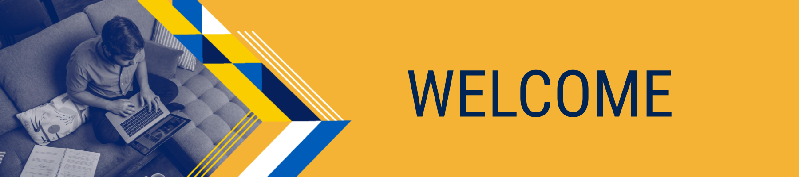
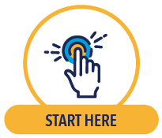
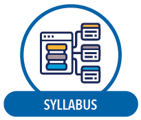
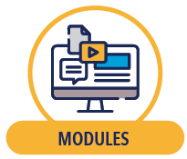

# Home Page

> Canvas status: **active**

## **Welcome!**

**Welcome to CS499/599**!
I'm Dr. Igor Steinmacher, and I'll be the instructor for this course (see more about me on the [About Your Instructor page](about-your-instructor.md "About Your Instructor")).

**Course objective:** In this course, we will learn and be exposed to Open Source Software (OSS) projects. OSS projects are inherently collaborative and social environments. Participation in this kind of project will help us interact with real systems, real problems, and real software development teams interested in building high-quality working software.

**Synchronous support:** I hold office hours every Thu/Fri 9:00 am-10:00 am

**Communication resources:** Another way to interact with the instructor and classmates is through our Discord server. Take a couple of minutes to introduce yourself in the #introduce\_yourself channel! I started it so that you have a lead! Feel free to react to or reply to each other's messages to comment on shared interests.

### **Navigation Tip**

The left-side navigation menu includes a [Modules](../modules/02-module-0-start-here/README.md "TEMPLATE - Welcome: Start Here! ") button where you will access learning content, the [Course Overview,](lecture-0-course-overview-syllabus-day.md "Course Overview ") the [About Your Instructor page,](about-your-instructor.md "About Your Instructor") and other helpful resources (including Canvas support). Or you may navigate within the course using the icons below. When you are ready, begin with the **Start Here Module**.

If you are accessing this course from a mobile device, please review the following: [Mobile Guides - Canvas Student.](https://design.instructure.com/courses/178/pages/canvas-student-app "Mobile Guides - Canvas Student")

---
